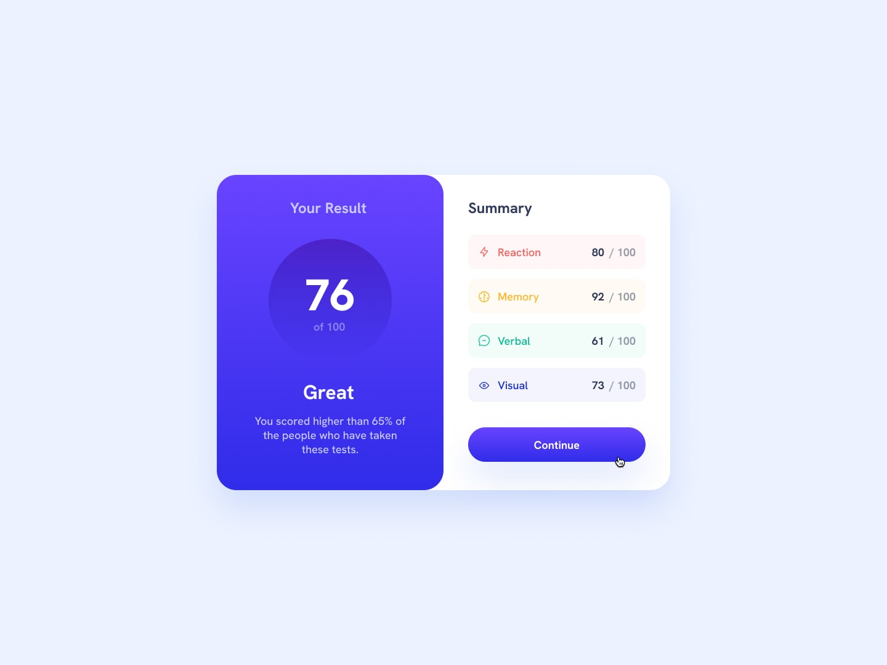

# 📊 Results Summary Component

This is a solution to the [Results Summary Component challenge on Frontend Mentor](https://www.frontendmentor.io/challenges/results-summary-component-CE_K6s0maV). This challenge helped me practice using **React**, working with **local JSON data**, and styling components dynamically based on content.

---

## 📋 Table of Contents

- [Overview](#overview)  
  - [Screenshot](#screenshot)  
  - [Live Links](#live-links)  
  - [Built With](#built-with)  
- [Author](#author)

---

## Overview

Users should be able to:

- View the optimal layout depending on their device’s screen size.
- See hover and focus states for all interactive elements.
- Dynamically display data from a local JSON file.
- See a visually appealing and accessible results card.

---

### Screenshot

---

### Live Links

- 📁 GitHub Repository: [Results Summary Component](https://github.com/vedantagrawal524/results-summary-component)  
- 🌐 Live Site: [https://results-summary-component524.vercel.app/](https://results-summary-component524.vercel.app/)

---

### Built With

- React  
- HTML5  
- CSS Flexbox & Grid  
- React
- Mobile-first workflow  
- Local JSON data handling  
- [Vercel](https://vercel.com/) for deployment

---

## Author

- Portfolio – _Vedant Agrawal_  
- Frontend Mentor – [@vedantagrawal524](https://www.frontendmentor.io/profile/vedantagrawal524)  
- GitHub – [@vedantagrawal524](https://github.com/vedantagrawal524)

---

📝 _Coded with focus, fun, and finesse. Feel free to explore, fork, or suggest improvements!_
